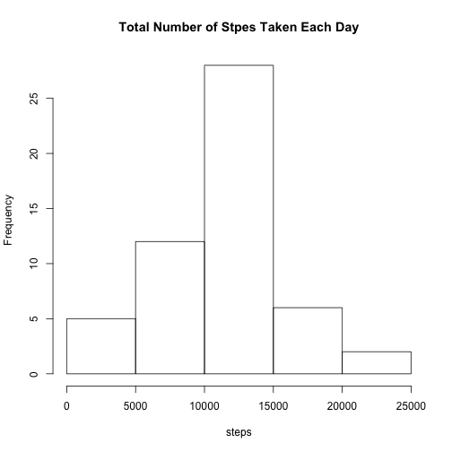
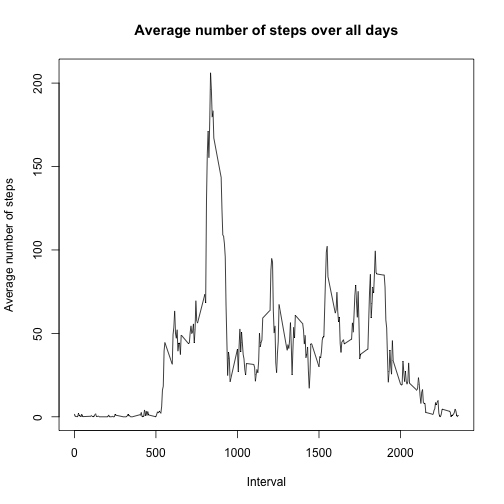
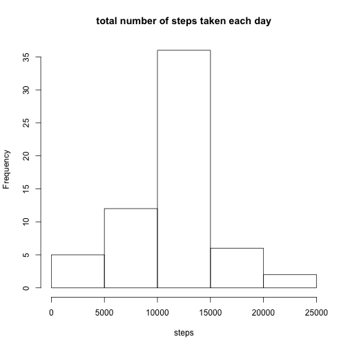
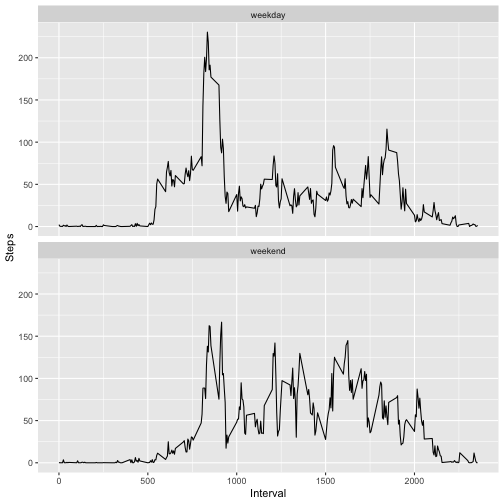

Reproducible Research Project 1
==============================


```r
library(ggplot2)
```


## Loading and preprocessing the data

1.download the file and unzip the data file

```r
dataUrl <- "https://d396qusza40orc.cloudfront.net/repdata%2Fdata%2Factivity.zip"
download.file(dataUrl,destfile='./data.zip', method='curl')
unzip(zipfile = "./data.zip",exdir="./")
```

2.read the data file and assign to varaible data

```r
data <- read.csv("./activity.csv")
data0 <- data[complete.cases(data),]
```

## What is mean total number of steps taken per day?

1. Calculate the total number of steps taken per day

```r
steps_by_day <- aggregate(data0$steps,by=list(data0$date), FUN=sum)
colnames(steps_by_day) <- c("date","steps")
steps_by_day
```

```
##          date steps
## 1  2012-10-02   126
## 2  2012-10-03 11352
## 3  2012-10-04 12116
## 4  2012-10-05 13294
## 5  2012-10-06 15420
## 6  2012-10-07 11015
## 7  2012-10-09 12811
## 8  2012-10-10  9900
## 9  2012-10-11 10304
## 10 2012-10-12 17382
## 11 2012-10-13 12426
## 12 2012-10-14 15098
## 13 2012-10-15 10139
## 14 2012-10-16 15084
## 15 2012-10-17 13452
## 16 2012-10-18 10056
## 17 2012-10-19 11829
## 18 2012-10-20 10395
## 19 2012-10-21  8821
## 20 2012-10-22 13460
## 21 2012-10-23  8918
## 22 2012-10-24  8355
## 23 2012-10-25  2492
## 24 2012-10-26  6778
## 25 2012-10-27 10119
## 26 2012-10-28 11458
## 27 2012-10-29  5018
## 28 2012-10-30  9819
## 29 2012-10-31 15414
## 30 2012-11-02 10600
## 31 2012-11-03 10571
## 32 2012-11-05 10439
## 33 2012-11-06  8334
## 34 2012-11-07 12883
## 35 2012-11-08  3219
## 36 2012-11-11 12608
## 37 2012-11-12 10765
## 38 2012-11-13  7336
## 39 2012-11-15    41
## 40 2012-11-16  5441
## 41 2012-11-17 14339
## 42 2012-11-18 15110
## 43 2012-11-19  8841
## 44 2012-11-20  4472
## 45 2012-11-21 12787
## 46 2012-11-22 20427
## 47 2012-11-23 21194
## 48 2012-11-24 14478
## 49 2012-11-25 11834
## 50 2012-11-26 11162
## 51 2012-11-27 13646
## 52 2012-11-28 10183
## 53 2012-11-29  7047
```

2. Make a histogram of the total number of steps taken each day

```r
hist(steps_by_day$steps,main="Total Number of Stpes Taken Each Day", xlab="steps")
```



3.Calculate and report the mean and median of the total number of steps taken per day

```r
steps_mean <- mean(steps_by_day$steps)
steps_mean
```

```
## [1] 10766.19
```

```r
steps_median <- median(steps_by_day$steps)
steps_median
```

```
## [1] 10765
```
**Mean of total number of steps is 10766.19 and median is 10765.**


## What is the average daily activity pattern?
1.Make a time series plot of the 5-minute interval (x-axis) and the average number of steps taken, averaged across all days (y-axis)

```r
# Calculate the average number of steps taken, averaged across all days
steps_by_interval <- aggregate(steps~interval,data0,mean)

# Create the plot
with(steps_by_interval, plot(interval,steps,type="l",
                             main= "Average number of steps over all days",
                             xlab="Interval",
                             ylab="Average number of steps"))
```




2. Which 5-minute interval, on average across all the days in the dataset, contains the maximum number of steps?

```r
max_by_interval <- steps_by_interval$interval[steps_by_interval$steps == max(steps_by_interval$steps)]

steps_by_interval[steps_by_interval$interval == max_by_interval,]
```

```
##     interval    steps
## 104      835 206.1698
```
** Interval `max_by_interval` has the maximum average value of steps  `steps_by_interval$steps[steps_by_interval$interval == max_by_interval]` **


## Imputing missing values

1. Calculate and report the total number of missing values in the dataset

```r
sum(is.na(data))
```

```
## [1] 2304
```
**Total numer of missing values in the dataset is 2304. **

2. Devise a strategy for filling in all of the missing values in the dataset.
3. Create a new dataset that is equal to the original dataset but with the missing data filled in

```r
new_data <- data
for(i in 1:nrow(new_data)){
  if(is.na(new_data$steps[i])){
     interval_value <- new_data$interval[i]
     steps_value <- steps_by_interval[steps_by_interval$interval == interval_value,]
     new_data$steps[i] <- steps_value$steps
  }
}
```
**NAs are repalced with the mean of the 5-minute interval they are in and the new dataset: new_data is created with NAs replaced. **

4.Make a histogram of the total number of steps taken each day and Calculate and report the mean and median total number of steps taken per day. Do these values differ from the estimates from the first part of the assignment? What is the impact of imputing missing data on the estimates of the total daily number of steps?

```r
new_steps_by_day <- aggregate(new_data$steps,by=list(new_data$date), FUN=sum)
colnames(new_steps_by_day) <- c("date","steps")
hist(new_steps_by_day$steps,main="total number of steps taken each day",
     xlab="steps")
```



```r
new_steps_mean <- mean(new_steps_by_day$steps)
new_steps_mean
```

```
## [1] 10766.19
```

```r
steps_mean
```

```
## [1] 10766.19
```

```r
new_steps_median <- median(new_steps_by_day$steps)
new_steps_median
```

```
## [1] 10766.19
```

```r
steps_median
```

```
## [1] 10765
```
**The mean stays the same whereas the new median is slightly higher than the old dataset which NAs are just removed. Imputing missing values slightly increase the total daily number of steps.**

## Are there differences in activity patterns between weekdays and weekends?

1. Create a new factor variable in the dataset with two levels – “weekday” and “weekend” indicating whether a given date is a weekday or weekend day.

```r
new_data['type_of_day'] <- weekdays(as.Date(new_data$date)) 
new_data$type_of_day[new_data$type_of_day %in% c('Saturday','Sunday')] <- "weekend"
new_data$type_of_day[!new_data$type_of_day == "weekend"] <- "weekday"
```

2. Make a panel plot containing a time series plot of the 5-minute interval (x-axis) and the average number of steps taken, averaged across all weekday days or weekend days (y-axis). See the README file in the GitHub repository to see an example of what this plot should look like using simulated data.

```r
new_steps_by_interval <- aggregate(new_data$steps,by=list(new_data$interval,new_data$type_of_day),mean)
colnames(new_steps_by_interval) <- c("interval","type_of_day","steps")
qplot(interval,steps,data=new_steps_by_interval,geom="line",xlab="Interval",ylab="Steps") + facet_wrap(.~ type_of_day,ncol=1)
```




